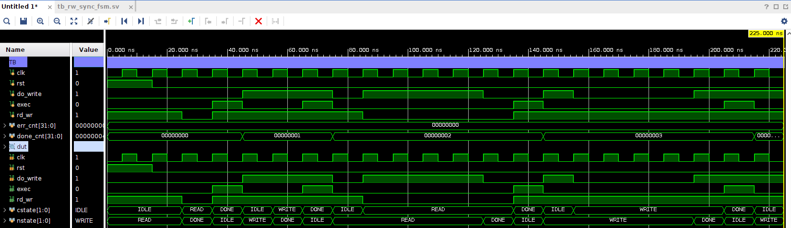

```markdown
# SoC Week 10 Assignment

**Student ID:** 2023066980  
**Name:** 김영진  
* **Vivado Project:** `./vivado_dir/rw_sync_fsm/rw_sync_fsm.xpr`
---

## 1. Directory Structure

```text
.
├── Makefile
├── README.md                  # Project report
├── cli_dir
│   └── ...
├── result/                    # Simulation outputs
│   ├── sim_run.log            # Simulation log with SVA results
│   ├── wave.fst               # Waveform file
│   └── waveform.png           # Waveform screenshot
├── rtl/                       # Design and verification sources
│   ├── constraints.sdc
│   ├── rw_sync_fsm.sv         # Top RTL design (FSM)
│   └── tb_rw_sync_fsm.sv      # Testbench
└── vivado_dir/                # Vivado project directory
    ├── create_prj.tcl         # ****Project creation script****
    └── rw_sync_fsm/
        ├── rw_sync_fsm.xpr    # Vivado project file
        └── ...

```

---

## 2. Key File Paths

### Execution & Project File

* **Vivado Project:** `./vivado_dir/rw_sync_fsm/rw_sync_fsm.xpr`

### Design & Verification Sources

* **RTL Design:** `./rtl/rw_sync_fsm.sv`
* **Testbench:** `./rtl/tb_rw_sync_fsm.sv`

### Simulation Results

* **Log File:** `./result/sim_run.log`
* **Waveform Files:**
* `./result/wave.fst`
* `./result/waveform.png`


---

## 3. Execution Commands

### Setup Vivado Project

Generate the Vivado project using the provided TCL script in batch mode:

```bash
cd vivado_dir && vivado -mode batch -source create_prj.tcl

```

### Run Vivado GUI

Open the generated project in Vivado GUI mode without generating logs/journals in the working directory:

```bash
vivado -mode gui ./vivado_dir/rw_sync_fsm/rw_sync_fsm.xpr -nolog -nojournal

```

---

## 4. Verification & Simulation

### Functional Verification

* **SystemVerilog Assertions (SVA):** The FSM behavior and state transitions are formally validated using embedded SV assertions.
* **Test Sequences Covered:**
* `read_seq`: Single read operation
* `write_seq`: Single write operation
* `burst_read_seq`: Consecutive burst read transactions
* `burst_write_seq`: Consecutive burst write transactions


### Simulation Result

* **Status:** **ALL TESTS PASSED**
* Verification details and assertion logs can be checked in `./result/sim_run.log`.

